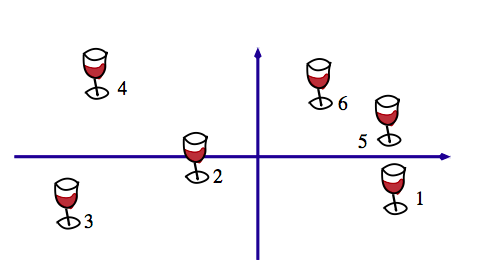

```{r setup, echo=FALSE}
options(width=120)
library(knitr)
opts_chunk$set(comment=NA)
#opts_knit$set(upload.fun = imgur_upload)  # for wordpress publishing

## install EBimage package from Bioconductor
# source("http://bioconductor.org/biocLite.R")
# biocLite("EBImage")
```
This document has also been published on my [*R you ready?* blog](https://ryouready.wordpress.com/2014/09/12/using-colorized-png-pictograms-in-r-base-plots).

Today I stumbled across a figure in an explanation on [multiple factor analysis](https://www.utdallas.edu/~herve/Abdi-MFA2007-pretty.pdf) which contained pictograms. 



[Figure 1](https://www.utdallas.edu/~herve/Abdi-MFA2007-pretty.pdf#page=8) from @abdi_multiple_2007, p. 8.

I wanted to reproduce a similar figure in R using pictograms and additionally color them e.g. by group membership . I have almost no knowledge about image processing, so I tried out several methods of how to achieve what I want. The first thing I did was read in an PNG file and look at the data structure. The package `png`allows to read in PNG files. Note that all of the below may not work on Windows machines, as it does not support semi-transparency (see `?readPNG`).

```{r}
library(png)
img <- readPNG(system.file("img", "Rlogo.png", package="png"))
class(img)
dim(img)
```

The object is a numerical array with four layers (red, green, blue, alpha; short RGBA). Let's have a look at the first layer (red) and replace all non-zero entries by a one and the zeros by a dot. This will show us the pattern of non-zero values and we already see the contours.

```{r eval=FALSE}
l4 <- img[,,1]
l4[l4 > 0] <- 1
l4[l4 == 0] <- "."
d <- apply(l4, 1, function(x) {
  cat(paste0(x, collapse=""), "\n") 
})
```

<pre><code> <div style="font-size:65%; line-height: 65%">
```{r echo=FALSE, results='asis'}
l4 <- img[,,1]
l4[l4 > 0] <- 1
l4[l4 == 0] <- "."
d <- apply(l4, 1, function(x) {
  cat(paste0(x, collapse=""), "\n") 
})
```
</div></code></pre>

To display the image in R one way is to raster the image (i.e. the RGBA layers are collapsed into a layer of single HEX value) and print it using `rasterImage`.

```{r}
rimg <- as.raster(img)            # raster multilayer object
r <- nrow(rimg) / ncol(rimg)      # image ratio
plot(c(0,1), c(0,r), type = "n", xlab = "", ylab = "", asp=1)
rasterImage(rimg, 0, 0, 1, r) 
```

Let's have a look at a small part the rastered image object. It is a matrix of HEX values.

```{r}
rimg[40:50, 1:6]
```

And print this small part.

```{r}
plot(c(0,1), c(0,.6), type = "n", xlab = "", ylab = "", asp=1)
rasterImage(rimg[40:50, 1:6], 0, 0, 1, .6) 
```

Now we have an idea of how the image object and the rastered object look like from the inside.
Let's start to modify the images to suit our needs.

In order to change the color of the pictograms, my first idea was to convert the graphics to greyscale and remap the values to a color ramp of may choice. To convert to greyscale there are tons of methods around (see e.g. [here](http://dcgi.felk.cvut.cz/home/cadikm/color_to_gray_evaluation/)). I just pick one of them I found on [SO](http://stackoverflow.com/questions/596216/formula-to-determine-brightness-of-rgb-color) by chance. With R=Red, G=Green and B=Blue we have

    brightness = sqrt(0.299 * R^2 + 0.587 * G^2 + 0.114 * B^2)

This approach modifies the PNG files after they have been coerced into a raster object.

```{r}
# function to calculate brightness values
brightness <- function(hex) {
  v <- col2rgb(hex)
  sqrt(0.299 * v[1]^2 + 0.587 * v[2]^2 + 0.114 * v[3]^2) /255
}

# given a color ramp, map brightness to ramp also taking into account 
# the alpha level. The defaul color ramp is grey
#
img_to_colorramp <- function(img, ramp=grey) {
  cv <- as.vector(img)
  b <- sapply(cv, brightness)
  g <- ramp(b)
  a <- substr(cv, 8,9)     # get alpha values
  ga <- paste0(g, a)       # add alpha values to new colors
  img.grey <- matrix(ga, nrow(img), ncol(img), byrow=TRUE)  
}

# read png and modify
img <- readPNG(system.file("img", "Rlogo.png", package="png"))
img <- as.raster(img)           # raster multilayer object
r <- nrow(img) / ncol(img)      # image ratio
s <- 3.5                        # size

plot(c(0,10), c(0,3.5), type = "n", xlab = "", ylab = "", asp=1)

rasterImage(img, 0, 0, 0+s/r, 0+s)  # original
img2 <- img_to_colorramp(img)       # modify using grey scale
rasterImage(img2, 5, 0, 5+s/r, 0+s)
```

Great, it works! Now Let's go and try out some other color palettes using `colorRamp` to create a color ramp.

```{r fig.width=5}
plot(c(0,10),c(0,8.5), type = "n", xlab = "", ylab = "", asp=1)

img1 <- img_to_colorramp(img)
rasterImage(img1, 0, 5, 0+s/r, 5+s)

reds <- function(x) 
  rgb(colorRamp(c("darkred", "white"))(x), maxColorValue = 255)
img2 <- img_to_colorramp(img, reds)
rasterImage(img2, 5, 5, 5+s/r, 5+s)

greens <- function(x) 
  rgb(colorRamp(c("darkgreen", "white"))(x), maxColorValue = 255)
img3 <- img_to_colorramp(img, greens)
rasterImage(img3, 0, 0, 0+s/r, 0+s)

single_color <- function(...) "#0000BB"
img4 <- img_to_colorramp(img, single_color)
rasterImage(img4, 5, 0, 5+s/r, 0+s)
```

Okay, that basically does the job. Now we will apply it to the wine pictograms.
Let's use [this wine glass](http://commons.wikimedia.org/wiki/File:Wineglass.svg) from Wikimedia Commons. It's quite big so I uploaded a [reduced size version to imgur](http://i.imgur.com/A14ntCt.png) . We will use it for our purposes.

```{r}
# load file from web
f <- tempfile()
download.file("http://i.imgur.com/A14ntCt.png", f)
img <- readPNG(f)
img <- as.raster(img)
r <- nrow(img) / ncol(img)
s <- 1

# let's create a function that returns a ramp function to save typing
ramp <- function(colors) 
  function(x) rgb(colorRamp(colors)(x), maxColorValue = 255)

# create dataframe with coordinates and colors
set.seed(1)
x <- data.frame(x=rnorm(16, c(2,2,4,4)), 
                y=rnorm(16, c(1,3)), 
                colors=c("black", "darkred", "garkgreen", "darkblue"))

plot(c(1,6), c(0,5), type="n", xlab="", ylab="", asp=1)
for (i in 1L:nrow(x)) {
  colorramp <- ramp(c(x[i,3], "white"))
  img2 <- img_to_colorramp(img, colorramp)
  rasterImage(img2, x[i,1], x[i,2], x[i,1]+s/r, x[i,2]+s)
}

```

Another approach would be to modifying the RGB layers before rastering to HEX values.

```{r}
img <- readPNG(system.file("img", "Rlogo.png", package="png"))
img2 <- img
img[,,1] <- 0    # remove Red component
img[,,2] <- 0    # remove Green component
img[,,3] <- 1    # Set Blue to max
img <- as.raster(img)
r <- nrow(img) / ncol(img)  # size ratio
s <- 3.5   # size
plot(c(0,10), c(0,3.5), type = "n", xlab = "", ylab = "", asp=1)
rasterImage(img, 0, 0, 0+s/r, 0+s)

img2[,,1] <- 1   # Red to max
img2[,,2] <- 0
img2[,,3] <- 0
rasterImage(as.raster(img2), 5, 0, 5+s/r, 0+s)
```

To just colorize the image, we could weight each layer.

```{r}
# wrap weighting into function
weight_layers <- function(img, w) {
  for (i in seq_along(w))
    img[,,i] <- img[,,i] * w[i]
  img
}

plot(c(0,10), c(0,3.5), type = "n", xlab = "", ylab = "", asp=1)
img <- readPNG(system.file("img", "Rlogo.png", package="png"))
img2 <- weight_layers(img, c(.2, 1,.2))
rasterImage(img2, 0, 0, 0+s/r, 0+s)

img3 <- weight_layers(img, c(1,0,0))
rasterImage(img3, 5, 0, 5+s/r, 0+s)
```

After playing around and hard-coding the modifications I started to search and found the [`EBimage` package](http://www.bioconductor.org/packages/2.11/bioc/vignettes/EBImage/inst/doc/EBImage-introduction.pdf) which has a lot of features for image processing that make ones life (in this case only a bit) easier.

```{r}
library(EBImage)
f <- system.file("img", "Rlogo.png", package="png")
img <- readImage(f) 
img2 <- img

img[,,2] = 0      # zero out green layer
img[,,3] = 0      # zero out blue layer
img <- as.raster(img)

img2[,,1] = 0
img2[,,3] = 0
img2 <- as.raster(img2)

r <- nrow(img) / ncol(img)
s <- 3.5
plot(c(0,10), c(0,3.5), type = "n", xlab = "", ylab = "", asp=1)
rasterImage(img, 0, 0, 0+s/r, 0+s)
rasterImage(img2, 5, 0, 5+s/r, 0+s)
```

EBImage is a good choice and fairly easy to handle. Now let's again print the pictograms.

```{r}
f <- tempfile(fileext=".png")
download.file("http://i.imgur.com/A14ntCt.png", f)
img <- readImage(f)

# will replace whole image layers by one value
# only makes sense if there is a alpha layer that 
# gives the contours
#
mod_color <- function(img, col) {
  v <- col2rgb(col) / 255
  img = channel(img, 'rgb')
  img[,,1] = v[1]   # Red
  img[,,2] = v[2]   # Green
  img[,,3] = v[3]   # Blue
  as.raster(img)  
}

r <- nrow(img) / ncol(img)  # get image ratio
s <- 1                      # size

# create random data
set.seed(1)
x <- data.frame(x=rnorm(16, c(2,2,4,4)), 
                y=rnorm(16, c(1,3)), 
                colors=1:4)

# plot pictograms 
plot(c(1,6), c(0,5), type="n", xlab="", ylab="", asp=1)
for (i in 1L:nrow(x)) {
  img2 <- mod_color(img, x[i, 3])
  rasterImage(img2, x[i,1], x[i,2], x[i,1]+s*r, x[i,2]+s)
}
```

Note, that above I did not bother to center each pictogram to position it correctly. This still needs to be done. Anyway, that's it! Mission completed.

### Literature

